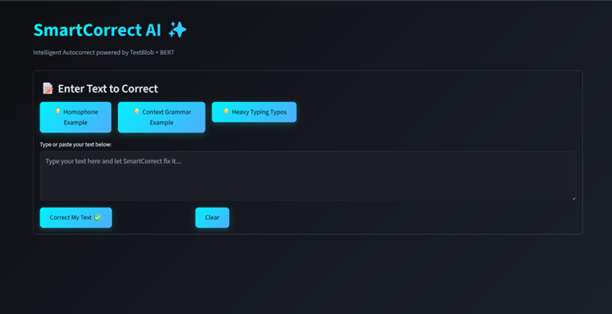
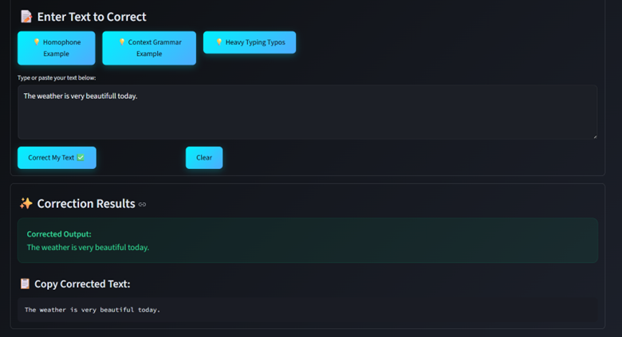
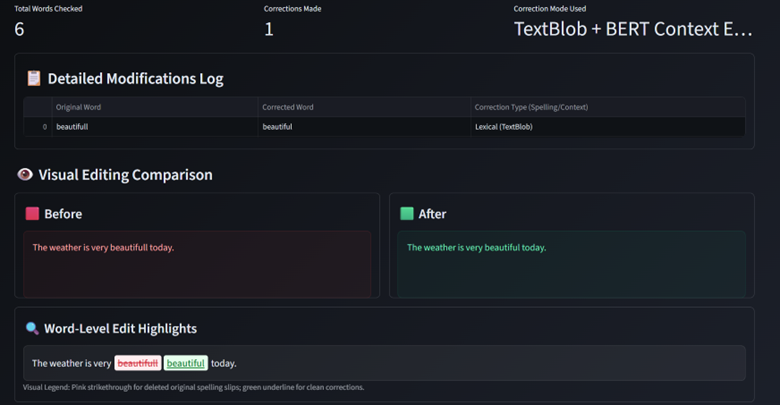
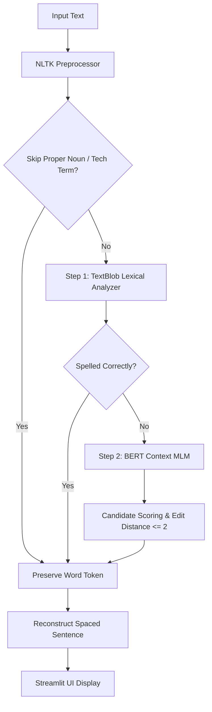

# SmartCorrect AI ✨

[](https://www.python.org/)
[](https://streamlit.io/)
[](https://opensource.org/licenses/MIT)

An intelligent, context-aware spellchecker and word predictor application. Unlike basic spellcheckers that only check if a word is in a dictionary, **SmartCorrect AI** combines **lexical dictionary verification** (using **TextBlob**) with **deep semantic sentence modeling** (using **BERT/DistilBERT**). 

This hybrid design lets it fix not only direct misspellings (e.g., *beautifull* $\to$ *beautiful*) but also **contextually wrong words** (e.g., *reed* $\to$ *read* in "I want to reed a book," or *there* $\to$ *their* in "He went to there house").

---

## 📸 Project Demo

Below is a visual preview of the running interactive Web Dashboard:

<p align="center">
  
  <br>
  <em>Interactive Web App featuring beautiful carbon dark glassmorphism styling, side-by-side comparative views, and visual highlights.</em>
</p>

<p align="center">
  
  <br>
  <em>Support for batch correction with downloadable DOCX / PDF reports and instant copy-to-clipboard utilities.</em>
</p>

<p align="center">
  
  <br>
  <em>Under the hood: Deep learning model inference logs, candidates' edit-distance metrics, and contextual scoring visualizations.</em>
</p>

---

## 🔮 Core Architecture & Pipeline

### How It Works: The 2-Step Correction Pipeline

SmartCorrect AI employs a dual-stage pipeline that marries lexicon lookup speeds with deep semantic understanding:



1. **Step 1: Lexical Spellcheck (TextBlob)**
   The input string is tokenized using NLTK while retaining all original spacing and casing. Each token is scanned against TextBlob's standard English lexicon. If the token is marked as misspelled, we extract spelling candidates and spelling similarity confidence scores.
   
2. **Step 2: Contextual Grammar Check (BERT MLM)**
   If a word matches correct lexical parameters but doesn't fit the sentence's contextual meaning, our BERT pipeline is triggered. By placing a `[MASK]` token in that position, BERT scans up to the top 100 grammatical alternatives. Candidates are filtered using a Levenshtein edit distance constraint ($\le 2$), proper noun framing protections, and technical Whitelists. If a candidate is at least 10 times more contextually appropriate, the homophone is replaced.

$$\text{Combined Score} = (\alpha \times \text{Spelling Similarity}) + ((1 - \alpha) \times \text{BERT Context Fit})$$

---

## ⚙️ Technologies Used

- **Streamlit**: Elegant web interface dashboard with dark glassmorphic styling.
- **Hugging Face Transformers**: Loads pre-trained Masked Language Models (BERT/DistilBERT).
- **PyTorch**: High-performance engine backing the deep learning neural pipeline.
- **TextBlob (NLTK-based)**: Provides fast lexical spellchecking and spelling distance candidates.
- **NLTK**: Standard library for precise sentence and word tokenization.
- **Pandas & NumPy**: Diagnostic logging tables and statistical probability math.

---

## 🚀 Quick Setup & Installation

Follow these simple, beginner-friendly instructions to install and launch the project on your machine.

### Prerequisites
Make sure you have **Python 3.9** or newer installed. You can verify your version by running:
```bash
python --version
```

### Installation

Install all required packages and dependencies with a single command:

```bash
pip install -r requirements.txt
```

> [!NOTE]
> This command installs all necessary deep learning packages (like PyTorch and Hugging Face Transformers) and web hosting libraries (like Streamlit) automatically in one step.

---

## 🎈 Running the Application

Launch the SmartCorrect AI Streamlit dashboard by executing the following command in your terminal:

```bash
streamlit run app.py
```

### First Launch Auto-Downloads (Internet Required)
When you run the application for the first time, it will automatically download:
1. **NLTK Datasets** (`punkt`, `wordnet`, `averaged_perceptron_tagger`, `averaged_perceptron_tagger_eng`) silently in the background.
2. **BERT Language Model** (~440MB) directly from Hugging Face.

*This only happens once. All subsequent launches will load instantly from your local disk cache and run **completely offline**.*

---

## 📋 Comprehensive Automated Test Suite

We have built a robust suite of unittests and a 20-sentence spelling/homophone accuracy benchmark inside `test_smartcorrect.py`:

```bash
# Run unit tests using pytest:
python -m pytest test_smartcorrect.py -v

# Run both unit tests and the 20-sentence accuracy evaluation console report:
python test_smartcorrect.py
```

---

## 🌐 Deployment to Streamlit Community Cloud

You can deploy this application for free to **Streamlit Community Cloud** (streamlit.io/cloud) by following this step-by-step guide:

### Step 1: Push Project to GitHub
1. Create a public repository on your [GitHub account](https://github.com/) named `SmartCorrect-AI`.
2. Open your terminal in the workspace root and initialize git:
   ```bash
   git init
   git add .
   git commit -m "Initialize SmartCorrect AI with cached BERT and robust testing"
   ```
3. Link and push to your public repo:
   ```bash
   git remote add origin https://github.com/YOUR_GITHUB_USERNAME/SmartCorrect-AI.git
   git branch -M main
   git push -u origin main
   ```

### Step 2: Connect GitHub to Streamlit Community Cloud
1. Visit [streamlit.io/cloud](https://streamlit.io/cloud) and sign up for a free account using your **GitHub login**.
2. Click on the **"New app"** button in your Streamlit Cloud workspace.
3. Select your repository (`SmartCorrect-AI`), branch (`main`), and set the main file path to:
   * **`app.py`**
4. Paste the URL of your repo directly or search for it in the dropdown list.

### Step 3: Launch & Deploy!
1. Under **"Advanced settings..."**, you can set environment variables if needed. For this project, **no secrets or environment variables are required**! The app will automatically read your `requirements.txt` and download BERT models silently upon launch on the server.
2. Click **"Deploy!"**. Streamlit will provision a secure container, install PyTorch, load the model cache, and deploy your site live to a shared public URL (e.g. `https://smartcorrect-ai.streamlit.app/`).
